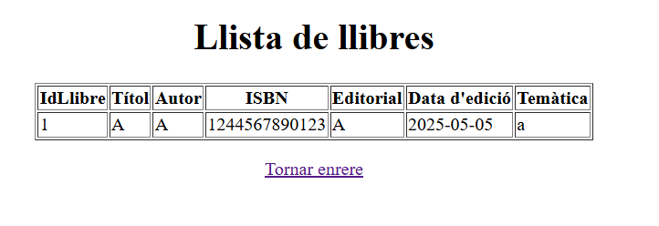
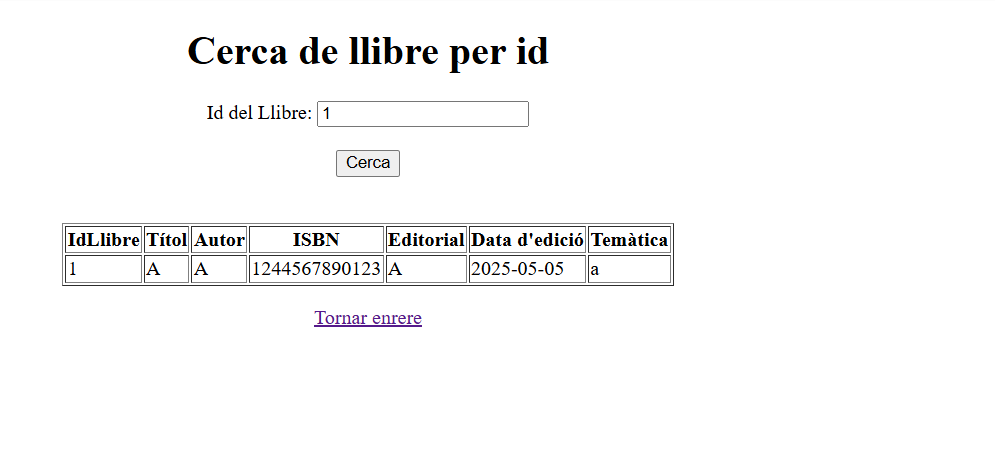
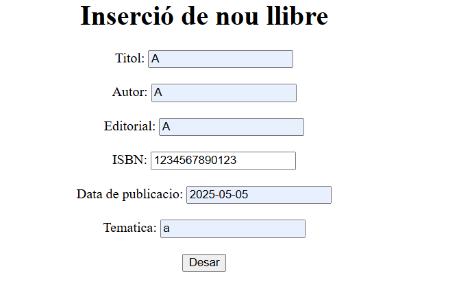

# MC_M06_UF04_AC01

Llistat dels llibres

Cerca dels llibres per ID

Inserir llibres

Per què al servei estem utilitzant mètodes que no hem declarat explícitament al repositori? Com és possible?

Perque aquest metodes son heredats de la classe pare de la qual el repositori es fill.

El repositori pot elegir fer l’extends de les interfícies PagingAndSortingRepository o de JpaRepository. En què es diferencien aquestes dues amb la interfície CrudRepository?

La interfície CrudRepository ve incorporada nomes amb els mètodes per a fer el CRUD basic de la nostra aplicació, mentres que el JPARepository o el PagingAndSortingRepository tenen mes metodes incorporats que per a la nostra applicació no necesitem.

Què significa Optional<Classe> i per a què serveix?

Serveix per que alhora de retornar un objecte d'aquesta classe pugui ser que no s'hagi trobat cap objecte i per tant sigui null. 

Per què el controlador utilitza el servei i no la seva implementació? 

Perque el controlador no li fa falta saber que fa el servei nomes el seus metodes, i per tant si fa servir el servei nosaltres podem anar canviant l'implementació sense que aixo afecti altres classes del nostre programa.

